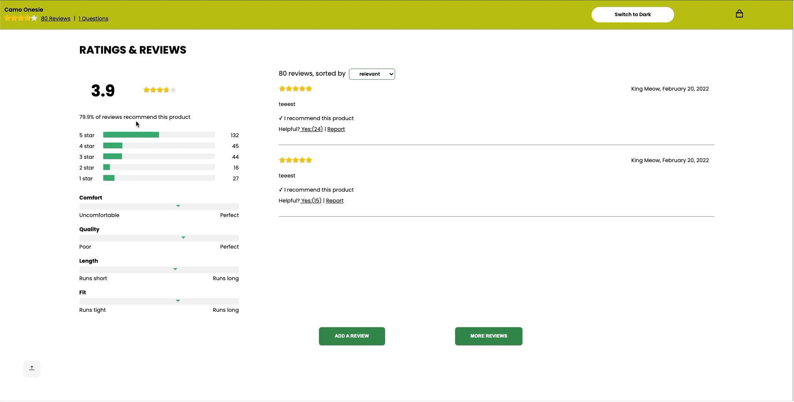

# FEC-Project

Overview
---
F.E.C. is an E-Commerce web application built with React and Express. This project was designed to grow our abilities to work in teams while building, maintaining, and optimizing a fully functioning webpage using React JS. Each team member was responsible for a single component that interacts with and manipulates the application as a whole. This allowed each of us to utilize new technologies while strengthening our understanding of front-end development. 

Tech/Frameworks
---
* [React](https://create-react-app.dev/)
* [Axios](https://www.npmjs.com/package/axios)
* [Babel](https://www.npmjs.com/package/Babel)
* [Express](https://www.npmjs.com/package/express)
* [Nodemon](https://www.npmjs.com/package/nodemon)
* [Moment](https://www.npmjs.com/package/moment)
* [Jest](https://www.npmjs.com/package/jest)
* [Webpack](https://www.npmjs.com/package/webpack)

Demo
---
**Theme Toggle: Light & Dark Themes**

**Main Product Overview & Cart Menu**

(https://drive.google.com/file/d/1Q3i8H1ctkA2jXccmVhso0NR96EecVENi/view?usp=sharing)

Product Overview displays a primary product with product information:

* A gallery of product images
* An assortment of styles to select for each product
* Product descriptions, slogans, features, and pricing
* Size and quantity available

**Ratings and Reviews**

**Write New Review **

Installation and Setup
---
To download a copy of this project to your local machine:
`$ git clone https://github.com/RFE2202-FEC-Zion-Narrows/FEC-Project.git`

Acquire a github personal access token to acquire access to the API. 

Insert token into `example.config.js` and rename file to `config.js`

`$ npm install`
`$ npm run dev:react`
`$ npm run start`

Runs the app in the development mode. 

Open [http://localhost:3000](http://localhost:3000/) to view it in the browser.

Contributors
---
* Sabrina Gortz - Product Overview
 * https://github.com/sgortz
* Hailee Lu - Related Products, Questions and Answers 
 * https://github.com/HuijunLu
* Katy Feng - Ratings and Reviews, Navigation bar, Shopping Cart Sidebar 
 * https://github.com/katyfsy
